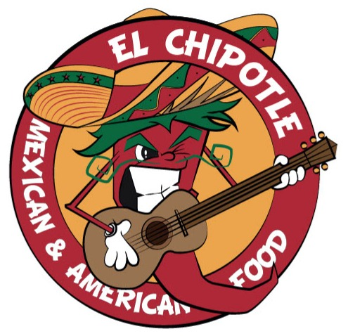

# 🌮 El Chipotle - Restaurante Mexicano



## 📋 Descripción

**El Chipotle** es una aplicación web moderna y elegante para un restaurante de comida mexicana y americana. El sitio web presenta un diseño atractivo, animaciones suaves y una experiencia de usuario excepcional.

## ✨ Características Principales

### 🎨 Diseño y UX
- **Diseño Responsivo**: Perfectamente adaptado para móviles, tablets y desktop
- **Animaciones Suaves**: Implementadas con AOS (Animate On Scroll)
- **Tema Mexicano**: Colores vibrantes (rojo, amarillo) con tipografía temática
- **Navegación Intuitiva**: Menú sticky con enlaces de navegación suaves

### 📱 Secciones del Sitio

1. **Hero Section**
   - Logo animado del restaurante
   - Llamados a la acción (Ver Menú, WhatsApp)
   - Fondo con imagen de alta calidad

2. **Historia**
   - Presentación del restaurante
   - Estadísticas clave (100% Fresco, 20+ Salsas, 4.9 Calificación)
   - Diseño con imagen y texto lado a lado

3. **Galería de Sabores**
   - Grid de imágenes interactivo
   - Efectos hover con overlays
   - Llamado a la acción de WhatsApp

4. **Menú Preview**
   - Tarjetas de productos destacados
   - Precios y descripciones
   - Enlaces a página de menú completo

5. **Menú Completo (Galería)**
   - Visualización de imágenes del menú completo
   - Lightbox para ver imágenes en grande
   - Navegación entre imágenes
   - Opción de descarga de menús

6. **FAQ (Preguntas Frecuentes)**
   - Acordeón interactivo
   - Preguntas comunes sobre el restaurante

7. **Ubicación y Footer**
   - Mapa de Google Maps integrado
   - Información de contacto
   - Horarios de atención
   - Redes sociales
   - Botón de WhatsApp

### 🛠️ Tecnologías Utilizadas

#### Frontend
- **React 19.2.0** - Librería de UI
- **Vite 7.2.4** - Build tool y dev server
- **React Router DOM** - Navegación entre páginas
- **Tailwind CSS v4** - Framework de CSS utility-first
- **PostCSS** - Procesador de CSS

#### Librerías Adicionales
- **Lucide React** - Iconos modernos
- **AOS (Animate On Scroll)** - Animaciones al hacer scroll
- **Google Fonts** - Tipografías (Rye, Poppins)

#### Herramientas de Desarrollo
- **ESLint** - Linter de código
- **@vitejs/plugin-react** - Plugin de React para Vite

## 🚀 Instalación y Uso

### Prerrequisitos
- Node.js (v16 o superior)
- npm o yarn

### Instalación

1. Clona el repositorio:
```bash
git clone https://github.com/JuaanPaablo/el-chipotle.git
cd el-chipotle
```

2. Instala las dependencias:
```bash
npm install
```

3. Inicia el servidor de desarrollo:
```bash
npm run dev
```

4. Abre tu navegador en `http://localhost:5173`

### Scripts Disponibles

- `npm run dev` - Inicia el servidor de desarrollo
- `npm run build` - Construye la aplicación para producción
- `npm run preview` - Previsualiza la build de producción
- `npm run lint` - Ejecuta el linter

## 📁 Estructura del Proyecto

```
el-chipotle/
├── public/
│   ├── logo/
│   │   └── logo.jpg
│   ├── imgs/
│   │   ├── comida1.jpg
│   │   ├── comida2.jpg
│   │   ├── comida3.jpg
│   │   ├── comida4.jpg
│   │   ├── comida5.jpg
│   │   └── comida6.jpg
│   └── menu/
│       ├── menu.png
│       └── menu2.png
├── src/
│   ├── components/
│   │   ├── home/
│   │   │   ├── Hero.jsx
│   │   │   ├── History.jsx
│   │   │   ├── Gallery.jsx
│   │   │   ├── MenuPreview.jsx
│   │   │   ├── FullMenuGallery.jsx
│   │   │   └── FAQ.jsx
│   │   ├── layout/
│   │   │   ├── Navbar.jsx
│   │   │   └── Footer.jsx
│   │   └── ui/
│   │       └── FloatingWhatsApp.jsx
│   ├── pages/
│   │   ├── Home.jsx
│   │   └── Menu.jsx
│   ├── utils/
│   │   └── constants.js
│   ├── App.jsx
│   ├── main.jsx
│   └── index.css
├── index.html
├── package.json
├── vite.config.js
├── tailwind.config.js
├── postcss.config.js
└── README.md
```

## 🎨 Paleta de Colores

- **Rojo Principal**: `#b91c1c` (Red-700)
- **Rojo Oscuro**: `#7f1d1d` (Red-900)
- **Amarillo**: `#fbbf24` (Yellow-400)
- **Gris Claro**: `#f5f5f4` (Stone-50)
- **Gris Oscuro**: `#1c1917` (Stone-900)

## 📞 Contacto

- **WhatsApp**: +593 99 940 2348
- **Dirección**: Av. Rafael Sanchez y José Miguel Leoro
- **Horarios**:
  - Lunes - Jueves: 12:00 PM - 10:00 PM
  - Viernes - Sábado: 12:00 PM - 12:00 AM
  - Domingo: 12:00 PM - 9:00 PM

## 🌟 Características Técnicas

### Optimizaciones
- Lazy loading de imágenes
- Code splitting con React Router
- Optimización de assets con Vite
- CSS minificado en producción

### Accesibilidad
- Navegación por teclado
- Alt text en todas las imágenes
- Contraste de colores WCAG AA
- Semántica HTML5

### SEO
- Meta tags optimizados
- Estructura de headings correcta
- URLs amigables
- Sitemap (próximamente)

## 📝 Licencia

Este proyecto es privado y pertenece a El Chipotle Restaurant.

## 👨‍💻 Desarrollador

**Juan Pablo Vásquez**
- GitHub: [@JuaanPaablo](https://github.com/JuaanPaablo)
- Email: juanpablovasquez32@gmail.com

---

⭐ Si te gusta este proyecto, ¡dale una estrella en GitHub!

🌮 **El Chipotle** - Donde la tradición mexicana se encuentra con el apetito voraz
